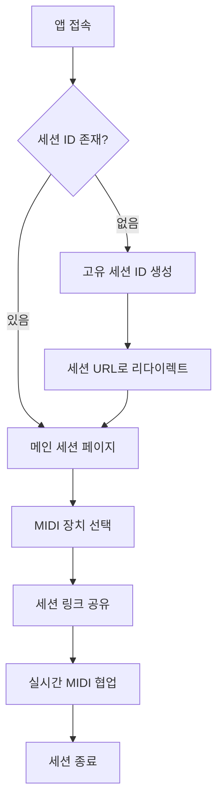

# 실시간 MIDI 세션 링크 앱 - 제품 요구사항 문서

## 1. Product Overview

Next.js 기반의 실시간 MIDI 세션 공유 웹 애플리케이션으로, 고유한 링크를 통해 여러 사용자가 실시간으로 MIDI 신호를 주고받을 수 있는 플랫폼입니다.
- 음악 제작자, 연주자, 프로듀서들이 원격으로 협업할 수 있도록 지원하며, 물리적 거리의 제약 없이 실시간 음악 세션을 가능하게 합니다.
- 전문 음악 제작 시장과 교육 분야에서 혁신적인 원격 협업 솔루션으로 자리잡을 것을 목표로 합니다.

## 2. Core Features

### 2.1 Feature Module

실시간 MIDI 세션 앱의 주요 페이지 구성:
1. **메인 세션 페이지**: 세션 관리, MIDI 장치 선택, 실시간 상태 표시, 링크 공유 기능
2. **세션 대기 페이지**: 세션 로딩 및 초기화 상태 표시

### 2.2 Page Details

| Page Name | Module Name | Feature description |
|-----------|-------------|---------------------|
| 메인 세션 페이지 | 세션 관리 모듈 | URL 쿼리 파라미터를 통한 세션 식별, 자동 세션 ID 생성 및 리다이렉트, 세션 링크 복사 기능 |
| 메인 세션 페이지 | MIDI 장치 선택 모듈 | 사용 가능한 MIDI 입력/출력 장치 드롭다운 메뉴, 장치 연결 상태 표시, 실시간 장치 감지 |
| 메인 세션 페이지 | 실시간 통신 모듈 | Supabase Realtime Broadcast를 통한 MIDI 데이터 송수신, 세션 참여자 간 실시간 메시지 중계 |
| 메인 세션 페이지 | 상태 표시 모듈 | Supabase 연결 상태, 현재 세션 ID, 참여 인원 수 (Presence 기능), MIDI 신호 활동 표시 |
| 메인 세션 페이지 | MIDI 신호 처리 모듈 | Web MIDI API를 통한 입력 신호 감지, 수신된 MIDI 데이터의 출력 장치 전달, 실시간 신호 모니터링 |
| 세션 대기 페이지 | 초기화 모듈 | 세션 로딩 상태, MIDI 권한 요청, Supabase 연결 초기화 |

## 3. Core Process

**메인 사용자 플로우:**
사용자가 앱에 접속하면 세션 ID 존재 여부를 확인합니다. 세션 ID가 없는 경우 자동으로 고유 ID를 생성하고 해당 세션 URL로 리다이렉트됩니다. 사용자는 MIDI 입력/출력 장치를 선택하고, 세션 링크를 다른 참여자들과 공유합니다. 모든 참여자의 MIDI 입력은 실시간으로 다른 참여자들의 출력 장치로 전송되어 협업 세션이 진행됩니다.

## 4. User Interface Design

### 4.1 Design Style

- **Primary Color**: #2563eb (파란색), **Secondary Color**: #10b981 (초록색)
- **Button Style**: 둥근 모서리 (rounded-lg), 그라데이션 효과가 있는 현대적 스타일
- **Font**: Inter 폰트, 제목 24px, 본문 16px, 작은 텍스트 14px
- **Layout Style**: 카드 기반 레이아웃, 상단 네비게이션, 중앙 정렬된 메인 컨텐츠 영역
- **Icon Style**: Heroicons 또는 Lucide React 아이콘, 음악 관련 이모지 (🎵, 🎹, 🔗) 활용

### 4.2 Page Design Overview

| Page Name | Module Name | UI Elements |
|-----------|-------------|-------------|
| 메인 세션 페이지 | 세션 관리 모듈 | 상단 헤더에 세션 ID 표시, 링크 복사 버튼 (클립보드 아이콘), 성공 토스트 메시지 |
| 메인 세션 페이지 | MIDI 장치 선택 모듈 | 좌측 사이드바에 드롭다운 메뉴, 연결 상태 인디케이터 (초록/빨강 점), 장치명 텍스트 |
| 메인 세션 페이지 | 상태 표시 모듈 | 우측 상단에 연결 상태 배지, 참여자 수 카운터, 실시간 활동 로그 영역 |
| 메인 세션 페이지 | MIDI 신호 처리 모듈 | 중앙 영역에 시각적 MIDI 활동 표시기, 파형 애니메이션, 신호 강도 바 |
| 세션 대기 페이지 | 초기화 모듈 | 중앙 로딩 스피너, 진행 상태 텍스트, 권한 요청 모달 |

### 4.3 Responsiveness

데스크톱 우선 설계로 개발되며, 태블릿과 모바일에서도 적응형 레이아웃을 제공합니다. 터치 인터랙션 최적화를 고려하여 버튼 크기와 간격을 조정하고, 모바일에서는 사이드바가 하단 탭으로 변경됩니다.