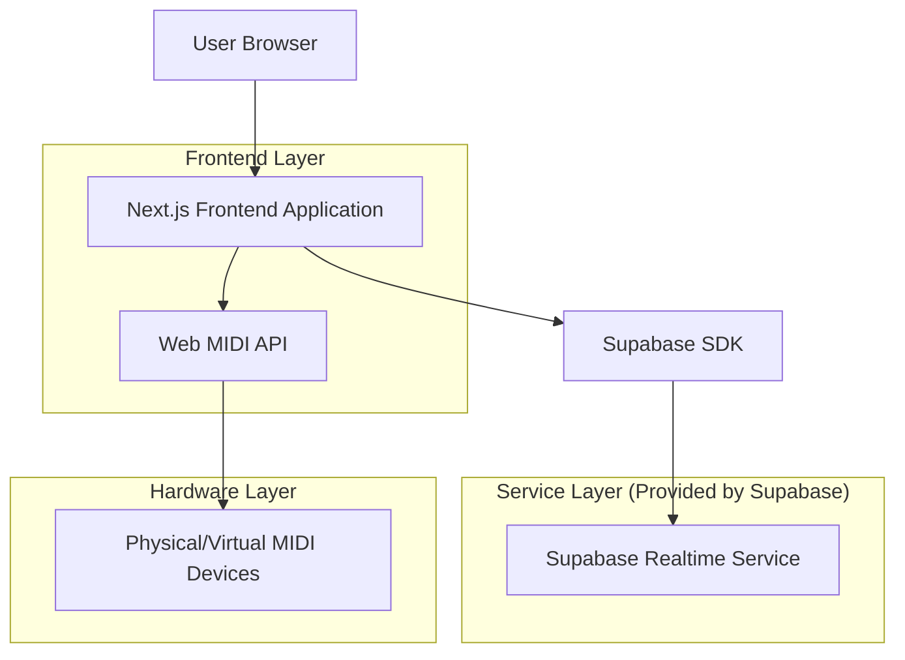
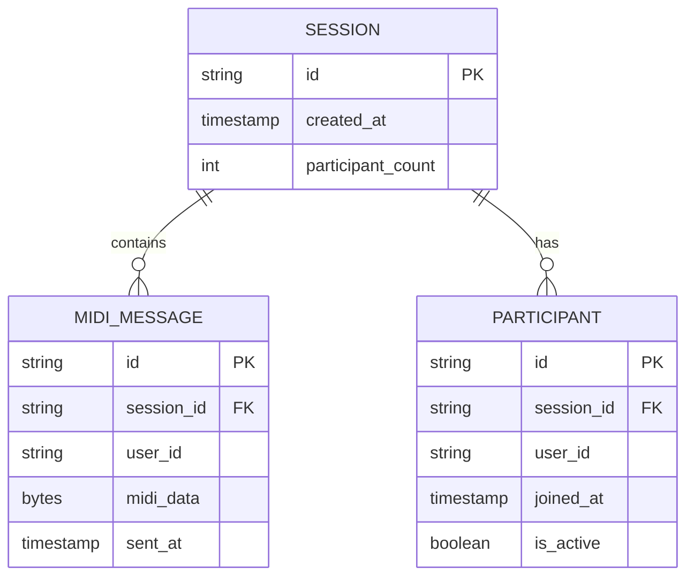

# 실시간 MIDI 세션 링크 앱 - 기술 아키텍처 문서

## 1. Architecture design



## 2. Technology Description

- Frontend: Next.js@15 + React@18 + TypeScript + Tailwind CSS@3 + Vite
- Backend: Supabase (Realtime Broadcast + Presence)
- APIs: Web MIDI API (브라우저 네이티브)
- Deployment: Vercel

## 3. Route definitions

| Route | Purpose |
|-------|---------|
| / | 메인 세션 페이지, 세션 ID 확인 및 생성, MIDI 세션 관리 |
| /?session={id} | 특정 세션 참여, 실시간 MIDI 협업 인터페이스 |

## 4. API definitions

### 4.1 Core API

**Supabase Realtime Broadcast**

MIDI 데이터 전송
```typescript
// 채널 구독
const channel = supabase.channel(`midi-session-${sessionId}`)

// MIDI 메시지 브로드캐스트
channel.send({
  type: 'broadcast',
  event: 'midi-message',
  payload: {
    data: Uint8Array, // MIDI 바이트 데이터
    timestamp: number,
    userId: string
  }
})
```

**Supabase Presence**

세션 참여자 관리
```typescript
// 참여자 상태 추적
channel.on('presence', { event: 'sync' }, () => {
  const presenceState = channel.presenceState()
  // 참여자 수 업데이트
})

// 참여자 등록
channel.subscribe(async (status) => {
  if (status === 'SUBSCRIBED') {
    await channel.track({
      userId: generateUserId(),
      joinedAt: new Date().toISOString()
    })
  }
})
```

**Web MIDI API**

MIDI 장치 관리
```typescript
// MIDI 접근 요청
navigator.requestMIDIAccess().then((midiAccess) => {
  // 입력 장치 이벤트 리스너
  midiAccess.inputs.forEach((input) => {
    input.onmidimessage = (message) => {
      // Supabase로 MIDI 데이터 전송
    }
  })
})

// MIDI 메시지 출력
outputDevice.send([noteOn, note, velocity], timestamp)
```

## 5. Data model

### 5.1 Data model definition



### 5.2 Data Definition Language

**세션 테이블 (sessions)**
```sql
-- 세션 정보 테이블 생성
CREATE TABLE sessions (
    id UUID PRIMARY KEY DEFAULT gen_random_uuid(),
    session_key VARCHAR(255) UNIQUE NOT NULL,
    created_at TIMESTAMP WITH TIME ZONE DEFAULT NOW(),
    participant_count INTEGER DEFAULT 0,
    is_active BOOLEAN DEFAULT true
);

-- 인덱스 생성
CREATE INDEX idx_sessions_session_key ON sessions(session_key);
CREATE INDEX idx_sessions_created_at ON sessions(created_at DESC);

-- RLS 정책 설정
ALTER TABLE sessions ENABLE ROW LEVEL SECURITY;

-- 기본 접근 권한
GRANT SELECT ON sessions TO anon;
GRANT ALL PRIVILEGES ON sessions TO authenticated;

-- 정책 생성
CREATE POLICY "Anyone can read sessions" ON sessions
    FOR SELECT USING (true);

CREATE POLICY "Anyone can create sessions" ON sessions
    FOR INSERT WITH CHECK (true);
```

**MIDI 메시지 로그 테이블 (midi_messages)**
```sql
-- MIDI 메시지 로그 테이블 생성 (선택적)
CREATE TABLE midi_messages (
    id UUID PRIMARY KEY DEFAULT gen_random_uuid(),
    session_id UUID REFERENCES sessions(id) ON DELETE CASCADE,
    user_id VARCHAR(255) NOT NULL,
    midi_data BYTEA NOT NULL,
    sent_at TIMESTAMP WITH TIME ZONE DEFAULT NOW()
);

-- 인덱스 생성
CREATE INDEX idx_midi_messages_session_id ON midi_messages(session_id);
CREATE INDEX idx_midi_messages_sent_at ON midi_messages(sent_at DESC);

-- RLS 정책 설정
ALTER TABLE midi_messages ENABLE ROW LEVEL SECURITY;

-- 기본 접근 권한
GRANT SELECT ON midi_messages TO anon;
GRANT ALL PRIVILEGES ON midi_messages TO authenticated;

-- 정책 생성
CREATE POLICY "Anyone can read midi messages" ON midi_messages
    FOR SELECT USING (true);

CREATE POLICY "Anyone can insert midi messages" ON midi_messages
    FOR INSERT WITH CHECK (true);
```

**참여자 테이블 (participants)**
```sql
-- 참여자 정보 테이블 생성
CREATE TABLE participants (
    id UUID PRIMARY KEY DEFAULT gen_random_uuid(),
    session_id UUID REFERENCES sessions(id) ON DELETE CASCADE,
    user_id VARCHAR(255) NOT NULL,
    joined_at TIMESTAMP WITH TIME ZONE DEFAULT NOW(),
    last_seen TIMESTAMP WITH TIME ZONE DEFAULT NOW(),
    is_active BOOLEAN DEFAULT true
);

-- 인덱스 생성
CREATE INDEX idx_participants_session_id ON participants(session_id);
CREATE INDEX idx_participants_user_id ON participants(user_id);

-- RLS 정책 설정
ALTER TABLE participants ENABLE ROW LEVEL SECURITY;

-- 기본 접근 권한
GRANT SELECT ON participants TO anon;
GRANT ALL PRIVILEGES ON participants TO authenticated;

-- 정책 생성
CREATE POLICY "Anyone can read participants" ON participants
    FOR SELECT USING (true);

CREATE POLICY "Anyone can manage participants" ON participants
    FOR ALL USING (true);
```